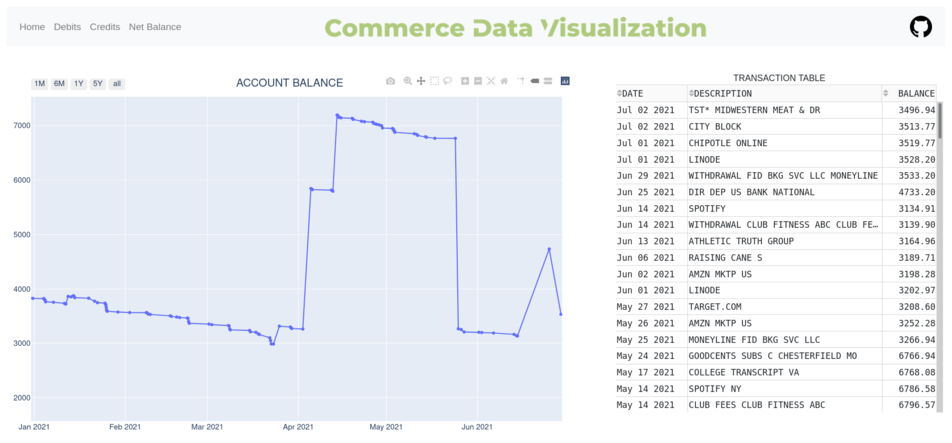
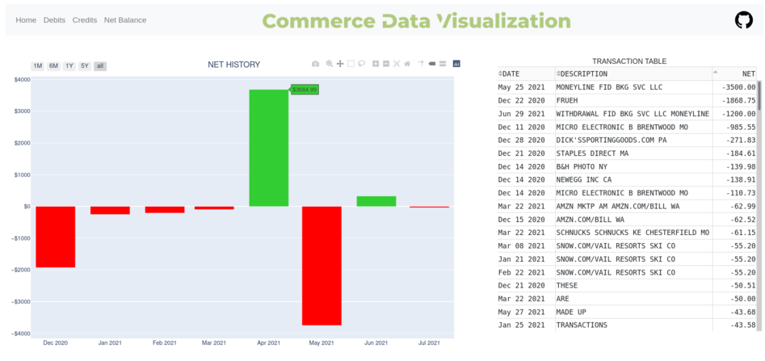
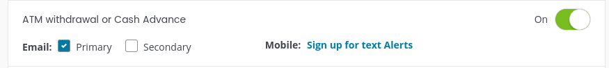
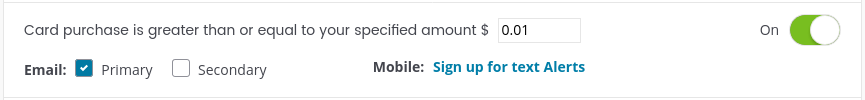
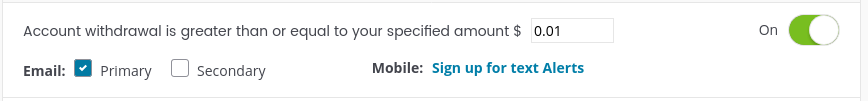
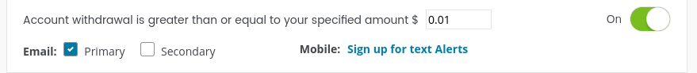

<p align="center">
  
</p>


Commerce Data Visualization is a web based banking application used to analyze bank account data for Commerce Bank customers. This web application allows users to make sense out of their transaction data via transaction graphs and tables. Data figures are split up between different categories (debits, credits, etc.), and allow the user to sort their data with various identifiers



The goal of this project was to give myself an easy way to view my transactions and keep track of my financial goals, as well as monitor for unauthorized transactions. Commerce Bank does not officially provide any data visualization tools (at least for free personal accounts). Any other Commerce Bank user looking to visualize their transaction data can utilize this application



This web application is run locally to protect your own data. The application is initially loaded with data that you will export from the Commerce Bank online banking portal (6 months worth is what I believe most Commerce accounts get without paying extra). The application uses the Commerce Bank Alerts feature and Gmail's API to automatically update your local transaction data without having to manually export it continuously


# Setup Instructions

## Commerce Setup

Go to your Commerce Bank account and download your transactions as a CSV file (should be named export.csv), then place that file in the resources folder

If you want the application to automatically update your transaction database, set up Commerce Alerts to a gmail account. On the same page you downloaded transactions, set the primary email to a gmail account and press on manage alerts and account and card alerts. Set email alerts for at least these fields:









Currently, Commerce Alerts lack some features. From what I've seen so far it does not alert you about transfers from another Commerce Bank account, and it does not provide the value for direct deposit alerts. The application will signal the user for input in cases like these where it may need to know the dollar amount

The Gmail API only queries for and reads emails from Commerce Bank Alerts. If you don't want to use the Alerts feature, simply comment out this line in python_scripts/app.py

```python3
update.update(20)
```

## Application Setup

All my testing has been done through a Linux machine, however, Windows and Mac users should be able to adapt these instructions with a few tweaks

Requires Python3, SQLite3, and pip to be installed

After all three are installed, run this command

```bash
bash run.sh -s
```

-s signals the script to use the setup process, any future run will not need to pass any parameters to the script. If you are having any issues with pip, make sure its upgraded to the latest version

If using the Alerts feature, the script will redirect you to a webpage to set up the Gmail API. After that, the program will prompt you for your current available account balance to finish initializing the transaction database. After that, the web application will be available to view only on your local machine at the follwing URL

```
localhost:8050
```


# Areas For Improvement

The main branch of this repo at the moment contains all the features that were in my original MVP plan for Commerce Data Visualization. Features that may be added in the future include

- On Hover and On Click graph interaction
- Querying the Transaction Database
- Give different time period options to group by in Debit/Credit/Net-Balance
- Let users create categories to automatically place transactions in
- Edit Gmail API to be more efficient (currently does not delete already processed alerts)
- Windows Executeable? (all python scripts should be good for Windows, just need to test it myself in a Windows environment)
