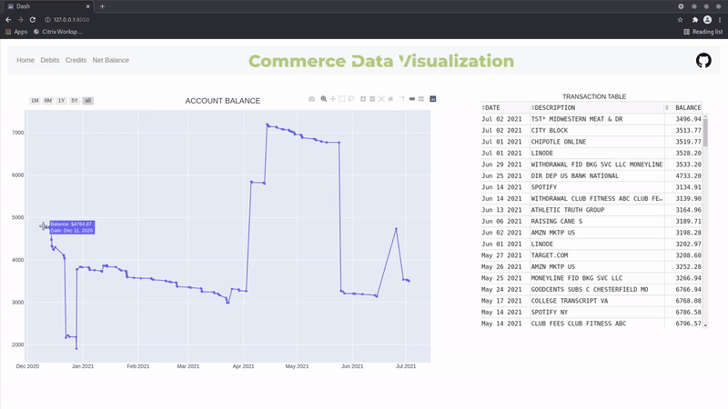

<p align="center">
  
</p>

<br />

Commerce Data Visualization is a web based banking application used to analyze bank account data for Commerce Bank customers. Though since I've integrated the [Plaid API](https://www.plaid.com), this application should work with other banking institutions (a name change might be in order, but I really like this logo, so I'm gonna keep if for now). This web application allows users to make sense out of their transaction data via transaction graphs and tables. Data figures are split up between different categories (debits, credits, etc.), and allow the user to sort their data in various ways

<p align="center">
  
</p>

The goal of this project was to give myself an easy way to view my transactions and keep track of my financial goals, as well as monitor for unauthorized transactions. Commerce Bank does not officially provide any data visualization tools (at least for free personal accounts). Any other Commerce Bank user looking to visualize their transaction data can utilize this application (and maybe other checking and savings accounts, though I have not been able to test their functionality).


This web application is run locally (besides a quick secure connection between yourself and the Plaid API when fetching transaction data) to protect your own data. The application uses the Plaid API to automatically update your local transaction data without having to repeatedly log into your account and export your data manually


# Application Setup


All my testing has been done through either a Linux machine or WSL2, Ubuntu and Fedora. However, Windows and Mac users should be able to adapt these instructions with a few tweaks. Open an issue if you have any questions/run into issues

Application requires Python3 and pip to be installed

Create a development account at [Plaid API](https://www.plaid.com) (this is free). Add a .env file to the directory as they describe in the PLAID quickstart guide,
including your PLAID keys and set PLAID_ENV=development. It will take a day or so to get approval for this development account

In the meantime, create a keypair for SSL by running the following command in the scope of the resources directoy (or follow the comments at the bottom of python_scripts/server.py if you want to skip this step)

```bash
openssl req -x509 -newkey rsa:4096 -nodes -out cert.pem -keyout key.pem -days 365
```

To use the alternate method, run this command instead

```
pip install pyopenssl
```

Now that all that is complete, go ahead and install the remaining dependencies and run the application (additional command flags are described in the comments of run.sh)

```bash
python3 -m pip install -r requirements.txt
bash run.sh
```

# Areas For Improvement

The main branch of this repo at the moment contains all the features that were in my original MVP plan for Commerce Data Visualization. However, after finding out about Plaid API, there are many more features I could see myself adding. Features that may be added in the future include

- Pie Chart by X time period, or by category
- Searching for transactions by description
- Aggregate data on transactions by user defined criteria
- Give different time period options to group by in Debit/Credit/Net-Balance
- Let users create categories to automatically place transactions in (or use Plaid categories)
- Windows Executeable? (all python scripts should be good for Windows, just need to test it myself in a Windows environment)
- Various frontend improvements


*NEITHER I NOR THIS APPLICATION IS AFFILIATED WITH COMMERCE BANK*
